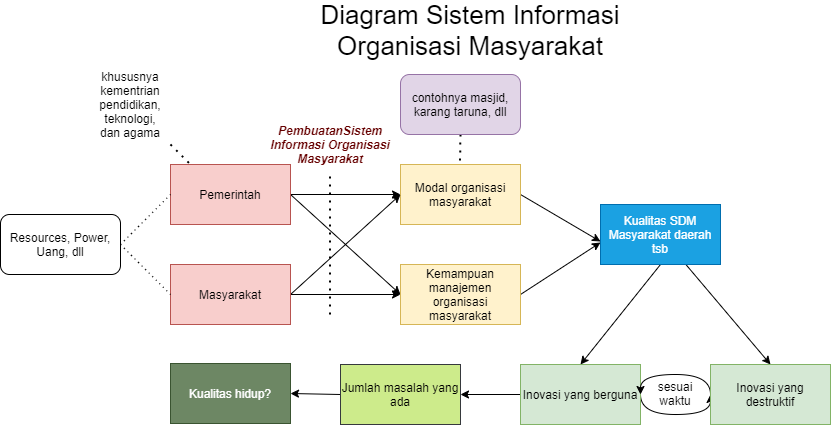

```
Metadata 

Manifesto

```

بسم الله الرحمن الرحيم

# Akselerasi Smart City Melalui Masjid Berprestasi

### Keywords

Social Credit System, Sistem Organisasi Masyarakat, Sistem Pendidikan, Akselerasi Smart City

### Abstrak

Pembuatan Social Credit System di tingkat individu dan Sistem Organisasi Masyarakat di ruang lingkup masyarakat.

### Latar Belakang

- Infrastruktur sudah tersedia, namun belum dimanfaatkan secara optimal. Dengan jumlah masjid mencapai sekitar **800.000** di Indonesia, masih banyak masjid yang belum aktif atau tidak memiliki kegiatan terkait teknologi dan keberlanjutan manusia. Sistem informasi masjid masih banyak yang dikelola secara manual meskipun sudah ada berbagai aplikasi yang dapat memudahkan dan mempercepat proses tersebut.

- Masjid, yang tersebar di seluruh Indonesia, dapat menjadi tempat bagi seluruh elemen masyarakat, tanpa memandang agama. Di daerah non-Muslim atau di tempat tanpa masjid, ruang karang taruna atau ruang kosong yang nyaman dapat dijadikan alternatif untuk berkumpul.

- Masyarakat dengan jiwa sosial yang tinggi dan sering berkontribusi dalam kegiatan sedekah dapat menjadi dukungan yang signifikan untuk kelancaran program ini.

- Terdapat banyak anak muda dan orang tua yang memiliki motivasi untuk terus belajar dan menciptakan inovasi guna menyelesaikan berbagai masalah yang ada, serta aktif dalam kegiatan masyarakat.

#### Alur Diagram Sederhana



Penjelasan:

- Sumber daya dari pemerintah, baik dalam bentuk dana maupun pelatihan manajemen organisasi masyarakat, bersama dengan kontribusi dana dari masyarakat, akan meningkatkan modal dan keterampilan manajemen organisasi masyarakat.

- Peningkatan keterampilan manajemen akan berdampak pada peningkatan kualitas sumber daya manusia (SDM) di daerah tersebut.

- Kualitas SDM yang meningkat akan menghasilkan inovasi yang bersifat solutif, meskipun pada suatu waktu inovasi solutif tersebut akan menjadi usang dan berpotensi menjadi destruktif (seperti penemuan mesin uap).

- Semua inovasi dan penemuan akan mengalami siklus, dari yang bermanfaat menjadi tidak lagi berguna, dan dapat memengaruhi jumlah masalah yang ada di masyarakat.

- Oleh karena itu, kualitas SDM harus terus meningkat agar terus muncul inovasi yang dapat menyelesaikan dan mengurangi masalah yang ada.

- Apakah jumlah masalah yang sedikit dapat meningkatkan kualitas hidup? Tidak selalu. Kualitas hidup bersifat subjektif, dan untuk meningkatkan kualitas hidup, seseorang perlu memiliki sikap ketidaktahuan dan pengabaian, atau dengan kata lain, mengatur mindset mereka sendiri agar menganggap bahwa kualitas hidup mereka tinggi, meskipun kenyataannya mungkin tidak demikian.

### Masalah ➔ Usulan Solusi Umum

- **Kesenjangan Pendidikan** ➔ Demokratisasi pendidikan melalui organisasi masyarakat, dengan model yang lebih sesuai dengan perkembangan zaman daripada formalitas tradisional.

- **Kurikulum Pendidikan yang Membosankan** ➔ Rombak kurikulum menjadi lebih sederhana, memberikan kebebasan kepada masyarakat untuk mengejar minat mereka melalui organisasi masyarakat.

- **Hoax & Hate Speech di Medsos** ➔ Percepat pengembangan Machine Learning, Deep Learning, AI, atau teknologi lainnya. Diperlukan investasi besar dalam sektor pendidikan untuk melatih lebih banyak orang dalam bidang ini.

- **Korupsi** ➔ Transparansi total mengenai kekayaan masyarakat, termasuk sumber dan jumlah pajak. Implementasikan sistem social credit.

- **Masalah Kesehatan, Fisik atau Mental** ➔ Perlu pendidikan, dukungan sosial, fasilitas kesehatan, dan ruang untuk berbagi dan diskusi.

- **Westernisasi yang Berlebihan dan Budaya Konsumtif Tinggi tanpa Inovasi** ➔ Edukasi tentang etika, kondisi bumi, dan lainnya.

- **Ekologi, Perubahan Iklim, Pemanasan Global, Transportasi, dll** ➔ Orang yang memiliki kekuatan seharusnya bertanggung jawab untuk memberikan edukasi tentang isu-isu ini. Tetapi, jika pelakunya yang memiliki kekuatan, solusinya menjadi lebih kompleks.

- **Banyaknya UMKM yang Terbatas pada Makanan dan Pakaian** ➔ Indikasi kurangnya inovasi atau modal. Pendidikan yang kurang efektif perlu ditingkatkan, dan lembaga keuangan atau investor dapat membantu yang mengalami kekurangan modal.

- **Isu Radikalisme yang Indikatornya Tidak Jelas** ➔ Implementasikan sistem informasi sosial kredit atau skor kredit seperti dalam game. Ini dapat memberikan konsekuensi kepada mereka yang menciptakan masalah atau melakukan tindakan yang merugikan.

- **Banyaknya Jokes dan Meme yang Menyinggung** ➔ Jangan dianggap sebagai masalah, jika merasa tersinggung, tanggapilah dengan argumen ilmiah. Namun, tetap ada ruang untuk perdebatan mengenai standar humor yang aman dan menghargai semua orang.

Dari permasalahan-permasalahan di atas, terlihat bahwa solusi untuk semua masalah secara umum adalah tidak hanya meningkatkan, melainkan juga mengefektifkan pendidikan. Jadi, solusi yang terpikirkan oleh saya adalah bagaimana cara membuat pendidikan tersebar merata dan efektif.

Selain itu, banyaknya masalah seringkali disebabkan oleh miskomunikasi. Untuk mengurangi masalah yang disebabkan oleh kurangnya komunikasi yang efektif, solusinya adalah adanya sistem yang berbasis data yang dapat diandalkan sepenuhnya. Sistem yang dirancang ini harus benar-benar berbasis pada fakta dan data yang akurat.

> Karena pengetahuan saya terbatas pada organisasi di masyarakat, terutama di lingkungan masjid, alur pemikiran ini masih belum mencakup organisasi lain seperti karang taruna dan sebagainya.

#### Usulan Solusi Khusus

Pengintegrasian teknologi terhadap semua organisasi masyarakat.

#### Bentuk Aplikasi
Web atau aplikasi Android/IOS yang dapat diakses untuk memahami keadaan dan kondisi organisasi di sekitar rumah.

#### Harapan dari Program
Terwujudnya sebuah aplikasi yang dapat diakses oleh semua orang untuk mendorong inovasi masyarakat dalam menyelesaikan permasalahan lokal maupun global. Masyarakat dan pemerintah dapat mendorong inovasi dari organisasi melalui investasi atau pendanaan program. Diharapkan masyarakat menjadi proaktif dalam berpartisipasi di organisasi lokal untuk terus belajar, berinovasi, dan bahkan menjadi entrepreneur guna menciptakan lapangan pekerjaan, mengurangi pengangguran, serta kesenjangan sosial.

### Kendala yang Mungkin

- Tidak adanya dukungan dari pemerintah menjadi hambatan utama, sehingga program hanya dapat mengandalkan manajemen organisasi masyarakat tanpa adanya kolaborasi atau kerja sama antar organisasi.

- Kurangnya minat masyarakat untuk berkontribusi melalui sedekah, dengan mengandalkan penuh pada pemerintah. Dampaknya adalah minimnya inovasi di daerah tersebut karena ketidakberanian mengambil risiko akibat kurangnya modal.

- Manajemen organisasi yang kurang efektif, dengan program kerja yang tidak jelas dan tidak menghasilkan inovasi apa pun, hanya merupakan pemborosan anggaran. Solusinya adalah pemerintah perlu memberikan edukasi kepada pihak manajemen organisasi masyarakat untuk terus mengevaluasi program kerja agar menghasilkan output yang positif.

- Ketersediaan dana sudah terjamin, manajemen organisasi sudah berusaha, namun kurangnya partisipasi dan minat dari masyarakat, pemuda, atau orang dewasa untuk ikut program. Solusinya adalah melalui insentif dari aplikasi sosial kredit yang sudah dibuat, sehingga dapat memotivasi mereka untuk aktif di masjid, karang taruna, dan sebagainya.

- Ketakutan masyarakat terhadap perkembangan teknologi, khususnya kekhawatiran digantikan oleh kecerdasan buatan (AI) dan manusia punah. Solusinya mungkin hanya dengan hidup santai, menunggu wafat, dan mengabaikan segala tindakan.

- Sistem yang disalahgunakan, terutama oleh pemegang kekuasaan dalam membuat kebijakan. Protes dari individu atau kelompok dapat diabaikan, dan credit orang yang memprotes dapat dicurangi tanpa data yang valid atau bahkan data yang dimanipulasi. Ketidakadilan ini dapat menciptakan situasi yang lebih buruk daripada yang dijelaskan dalam buku *1984*.

### Usulan Tindakan yang Perlu Dilakukan

1. **Pemerintah:**
   - Rombak kurikulum pendidikan menjadi lebih sederhana. Materi yang diwajibkan adalah membaca dan menulis, sementara sisanya dapat disesuaikan dengan minat dan bakat individu.
   - Hindari pemaksaan pendidikan. Anggaran negara sebaiknya digunakan untuk memberikan pendidikan kepada mereka yang benar-benar berminat, menghindari stres, dan menciptakan suasana belajar yang menyenangkan. Guru yang memberikan pembelajaran monoton dan pelajar yang tidak serius harus diidentifikasi sebagai bentuk korupsi.

2. **Pemerintah:**
   - Setelah kurikulum disederhanakan, para pelajar akan memiliki lebih banyak waktu luang. Manfaatkan waktu luang ini melalui kegiatan ekstrakurikuler dan organisasi masyarakat.
   - Bangun Sistem Informasi Organisasi Masyarakat untuk meningkatkan keterlibatan pelajar. Infrastruktur IT harus dikembangkan di seluruh organisasi kemasyarakatan.

3. **Relawan atau Programmer Berbayar:**
   - Buat aplikasi sesuai dengan persyaratan yang telah ditetapkan, dengan memenuhi standar UI/UX dan logika aplikasi.

4. **Masyarakat:**
   - Wajibkan seluruh anggota masyarakat untuk mendaftar di aplikasi tersebut. Masyarakat yang tidak memiliki ponsel dapat didata oleh manajemen organisasi kemasyarakatan.

5. **Pemerintah:**
   - Berikan pelatihan manajemen kepada pengurus masjid. Pemerintah setempat bertanggung jawab memberikan pelatihan kepada Dewan Kemakmuran Masjid (DKM) tentang cara menggunakan aplikasi dan upaya untuk memakmurkan masjid dan melibatkan masyarakat.

6. **DKM Masjid:**
   - Setelah mendapat pelatihan, tugas manajemen masjid melibatkan pengembangan organisasi masjid, rekrutmen, dan pembentukan remaja masjid. Jadwalkan kegiatan dengan dokumentasi yang tepat untuk laporan pertanggungjawaban di periode berikutnya.

7. **Remaja Masjid atau Organisasi di Bawah DKM Masjid:**
   - Bentuk kelas belajar atau mentoring dengan melibatkan individu yang ahli di bidangnya. Rencanakan kegiatan rutin dan program kerja sesuai dengan departemen atau bidang masing-masing. Kolaborasi antara remaja masjid, DKM masjid, dan orang dewasa disarankan.

8. **DKM Masjid dan Individu Masyarakat:**
   - Catat setiap keaktifan individu di aplikasi pribadi untuk diverifikasi oleh manajemen masjid. Laporkan setiap kegiatan masjid ke aplikasi untuk penelitian lebih lanjut oleh juri dari pemerintah setempat.

9. **Juri dari Pemerintah:**
   - Lakukan perankingan berdasarkan tingkat keaktifan. Berikan penghargaan tambahan kepada yang masuk dalam peringkat tertinggi.

10. **Harapan untuk Reward:**
    - Semoga pemberian reward dapat menjadi insentif bagi semua pihak untuk aktif belajar, berinovasi, dan berwirausaha dalam menyelesaikan berbagai masalah yang dihadapi.

### Tujuan Khusus

Saya bertujuan untuk mentransformasi masjid-masjid dan organisasi masyarakat menjadi entitas yang benar-benar profesional dalam pengelolaan keuangannya, dengan istilah bahwa setiap masjid seakan-akan melakukan IPO (Initial Public Offering) untuk mencapai tingkat transparansi yang tinggi. Sedekah, zakat, dan dana lainnya dari masyarakat dianggap sebagai investasi.

Dalam konteks ini, penting bagi pihak manajemen masjid untuk melakukan manajemen dana masyarakat dengan cermat. Saya berharap agar dana yang terkumpul tidak hanya digunakan untuk biaya operasional atau pembangunan fisik/infrastruktur yang hanya meningkatkan prestise masjid tanpa memberikan manfaat nyata kepada masyarakat.

Manajemen harus bersifat kreatif dalam merancang rencana dan program sehingga masjid dapat menghasilkan output yang benar-benar memberikan solusi terhadap masalah-masalah masyarakat, seperti dalam hal materi (pengentasan kelaparan, perumahan, dll.), pendidikan (ilmu pengetahuan, teknologi, sosial-budaya), dan aspek-aspek lainnya. Selain itu, manajemen masjid juga harus terus berpikir tentang cara mengelola dana masjid agar terus berkembang.

Jika masjid dapat menghasilkan output yang memberikan manfaat yang jelas, saya yakin investor (masyarakat) akan terus mendukung dengan menyumbangkan dana karena mereka merasa terlibat dalam suatu proses kebermanfaatan. Program-program ini dapat berlanjut dan berkembang.

Dari segi pendidikan, saya berharap bahwa masyarakat akan menjadi lebih sadar akan tindakan mereka. Sebelum memberikan sedekah, masyarakat harus memastikan bahwa sumbangan mereka akan digunakan secara efektif dalam jangka panjang. Sebagai contoh, daripada memberikan ikan kepada seseorang yang kelaparan, lebih baik mengajarkan cara memancing. Selain membantu individu, kita juga harus mempertimbangkan dampaknya terhadap lingkungan, ekologi, dan faktor-faktor lainnya.

Dengan adanya transparansi melalui aplikasi ini, saya berharap dapat mengurangi rasa cemburu dari kalangan perempuan, terutama mereka yang mendukung feminisme. Biasanya, laporan keuangan masjid hanya disampaikan saat salat Jumat, tetapi melalui aplikasi ini, semua orang dapat melihat laporan keuangan secara berkala. Hal ini memungkinkan semua kalangan untuk menilai kinerja masjid dan memberikan saran yang konstruktif.

### Prinsip Opsional

- **Bahagia Bukan Tujuan Utama**

   Bahagia seharusnya dipandang bukan sebagai tujuan utama, tetapi sebagai konsekuensi dari kehidupan yang seimbang dan bertanggung jawab. Menyederhanakan kebahagiaan menjadi kegilaan dan ketidaktahuan (*ignorance*) tidaklah bijaksana. Adanya masalah global seperti pemanasan global menunjukkan bahwa kebahagiaan perlu diimbangi dengan kesadaran akan dampak perilaku kita terhadap lingkungan.

   > "Bahagia penting, tetapi bukanlah tujuan utama. Kesadaran akan tanggung jawab terhadap masalah seperti pemanasan global menunjukkan bahwa kebahagiaan perlu diintegrasikan dengan pemikiran yang bertanggung jawab terhadap lingkungan."

- **Produksi dan Kreativitas Lebih Baik Daripada Konsumsi Berlebihan**

   Fokus pada *produksi* dan *kreasi* lebih diutamakan daripada konsumsi berlebihan. Konsumsi yang tidak terbatas dapat merusak lingkungan dan mengakibatkan kehabisan sumber daya. Mengutamakan produksi berarti berkontribusi positif dengan menciptakan solusi dan produk yang berkelanjutan.

   > "Berfokus pada *produksi* dan *kreativitas* lebih baik daripada terus-menerus *mengkonsumsi*. Konsumsi berlebihan dapat merusak lingkungan dan menghabiskan sumber daya. Kita dapat menciptakan perubahan positif dengan berperan aktif dalam produksi solusi yang berkelanjutan."

- **Kesadaran akan Dampak Konsumsi Terhadap Lingkungan**

   Penting untuk memahami dampak konsumsi terhadap lingkungan dan mendorong konsumsi yang bertanggung jawab. Overpopulasi dan eksploitasi sumber daya alam adalah dampak dari pola pikir konsumtif yang tidak terkendali. Kesadaran ini harus diintegrasikan dalam pola pikir masyarakat agar dapat mengatasi masalah yang dihadapi dunia saat ini.

   > "Menyadari dampak konsumsi terhadap lingkungan adalah langkah penting. Overpopulasi dan eksploitasi sumber daya alam dapat diatasi dengan mengadopsi pola pikir konsumtif yang lebih bertanggung jawab dan berkelanjutan."

- **Peran Individu dalam Menyelesaikan Masalah**

   Setiap individu memiliki peran dalam menyelesaikan masalah global. Peningkatan kesadaran dan tanggung jawab individu dapat membantu mengatasi tantangan seperti pemanasan global. Kombinasi dari tindakan individu dapat memiliki dampak positif yang signifikan.

   > "Setiap individu memiliki peran dalam menyelesaikan masalah global. Kesadaran dan tanggung jawab individu dapat membantu mengatasi tantangan seperti pemanasan global, membentuk kontribusi positif yang bersama-sama memiliki dampak yang signifikan."

- **Arsitektur dan Inovasi yang Mencerahkan**

  *Architecting* dan menciptakan inovasi bukan hanya kegiatan yang menyenangkan, tetapi juga memiliki dampak positif yang signifikan. Sebagai contoh, seorang arsitek tidak hanya menikmati merancang sesuatu tetapi juga dapat meningkatkan pola pikir keseluruhan masyarakat agar tidak hanya menjadi konsumen. Misalnya, dari penikmat game menjadi pembuat game, dari yang dididik menjadi perancang pendidikan, dari penikmat teknologi menjadi perancang teknologi, dan dari penikmat sistem menjadi pembuat sistem.

  > "Menjadi arsitek atau perancang tidak hanya menghadirkan kesenangan pribadi tetapi juga merupakan kesempatan untuk membentuk pola pikir masyarakat agar lebih aktif berkontribusi daripada hanya menjadi konsumen."

- **From Owning to Sharing**

  Konsep kepemilikan perlu dipindahkan dari pusat perhatian masyarakat. Lebih dari sekadar memiliki barang-barang materi, kekayaan nyata terletak pada kontribusi positif untuk kesejahteraan bersama. Sharing bukan hanya sebatas uang dan materi, melainkan juga ilmu dan informasi. Melalui pendekatan ini, masyarakat dapat membentuk lingkungan yang lebih berkelanjutan dan adil.

  > "Kesejahteraan bukanlah tentang apa yang dimiliki, melainkan tentang apa yang telah dilakukan untuk kebaikan bersama. Sharing resources melibatkan lebih dari sekadar materi, mencakup juga berbagi ilmu dan informasi."

- **Peran Penting Feedback**

  Feedback adalah elemen kunci dalam menjaga kelangsungan sistem. Sistem tanpa feedback cenderung stagnan dan kurang efektif dalam mencapai tujuan. Dalam konteks pendidikan atau ujian masuk perguruan tinggi, pentingnya feedback terlihat sebagai kunci untuk menciptakan sistem yang lebih seimbang dan efektif.

  > "Feedback adalah kunci keberlanjutan sistem. Dalam hal pendidikan dan ujian masuk perguruan tinggi, pemberian feedback diperlukan untuk menciptakan sistem yang lebih seimbang dan efektif."

- **Mengurangi Kesempatan dan Kesengsaraan Bersama**

  Mencapai kesetaraan di berbagai tingkatan, dari individu hingga tingkat negara, menjadi fokus utama. Hal ini bertujuan untuk mengurangi kesenjangan yang merugikan kesejahteraan masyarakat. Teknologi juga dapat menjadi alat untuk membantu mereka yang kurang beruntung atau memiliki disabilitas agar dapat menikmati hak-hak yang sama dengan masyarakat umum.

  > "Mengurangi kesenjangan dan meningkatkan kesejahteraan bersama menjadi tujuan utama. Melalui penggunaan teknologi dengan bijaksana, kita dapat menciptakan masyarakat yang lebih inklusif dan berkelanjutan."

- **Mendorong Pemikiran Jauh ke Masa Depan**

  Transformasi pola pikir ini mendorong masyarakat untuk berpikir lebih jauh ke masa depan. Dari penyelesaian masalah lokal hingga perencanaan sistem ekonomi global yang lebih berkelanjutan, inisiatif ini membutuhkan keterlibatan aktif dari pemikir sistem, pemikir radikal, dan individu yang peduli terhadap lingkungan.

  > "Masyarakat diajak untuk berpikir jauh ke masa depan, mengatasi masalah mulai dari lingkungan sekitar hingga skala global. Pemikir sistem dan individu yang peduli diharapkan muncul untuk mencari solusi berkelanjutan."

Dengan adopsi pola pikir ini, diharapkan masyarakat dapat bersama-sama membangun dunia yang lebih baik dan lebih berkelanjutan untuk generasi mendatang.

### Poin-poin Sistem

#### Fokus Utama Pengembangan di Organisasi Masyarakat

- Sains Terapan dan Keterampilan Praktis

Semua individu yang ahli dalam bidangnya didokumentasikan. Diinginkan agar individu yang sudah bekerja dapat berpartisipasi dalam proses pembelajaran dan juga mendapatkan imbalan dari organisasi. Dari data yang terkumpul, dapat diklasifikasikan topik apa saja yang dikuasai oleh masyarakat. Selanjutnya, jika tidak ada ahli di suatu bidang di suatu daerah, diharapkan adanya pertukaran pengetahuan dengan daerah lain yang berdekatan. Jika jaraknya jauh, pertukaran pengetahuan harus dilakukan secara bertahap, baik melalui pertemuan langsung maupun secara online.

Sains terapan mencakup pemrograman, pembuatan mesin, pengamatan astronomi, geografi, dll. Guru kelas di organisasi bertanggung jawab membuat kurikulum sehingga di akhir kelas, siswa dapat menciptakan produk atau meningkatkan keterampilan mereka. Saya berharap adanya banyak inovasi yang muncul dari sini.

Contohnya, dalam kelas pemrograman, di akhir pembelajaran, siswa diharapkan mampu membuat aplikasi Android/web, memahami algoritma Machine Learning, atau menjadi stimulus untuk menciptakan kecerdasan buatan yang dapat menyelesaikan berbagai masalah. Siswa dari kelas yang diajarkan oleh guru teknik elektro atau mesin diharapkan mampu membuat robot atau mesin untuk membantu berbagai sektor. Mungkin mereka dapat menciptakan reaktor nuklir dari sekadar berkumpul-kumpul, meskipun agak ekstrem. Yang penting, adanya motivasi untuk berinovasi dalam menyelesaikan permasalahan yang ada.

Harapan saya adalah lahirnya banyak mesin ramah lingkungan yang dapat membantu dalam sektor-sektor yang masih banyak dikerjakan secara manual oleh manusia, serta adanya pembelajaran untuk membuat masyarakat menjadi lebih teratur. Contohnya adalah pengembangan teknologi pertanian modern, transportasi ramah lingkungan, perancangan wilayah dan arsitektur, penggunaan CCTV untuk memantau pelanggaran pembuangan sampah, dll.

Selain itu, keterampilan praktis seperti desain grafis, fotografi, sinematografi, menjadi youtuber, blogger, creative writing, dan menjadi influencer juga harus ditekankan. Diharapkan agar dari sini banyak content creator yang mampu memberikan edukasi, bukan hanya menciptakan konten untuk sensasi semata.

- Ilmu-ilmu Sosial

Ilmu-ilmu sosial, seperti antropologi, ekonomi, entrepreneurship, hukum, politik, psikologi, sejarah, sosiologi, dan social skills, diajarkan melalui seminar, ceramah, atau workshop yang dipandu oleh para ahli di bidangnya. Mahasiswa juga diharapkan dapat berperan sebagai pembicara dalam meningkatkan daya serap materi, sambil memilih topik-topik yang dianggap penting untuk diajarkan kepada masyarakat umum secara bergantian. Selain itu, kegiatan olahraga, bela diri, dan jalan-jalan juga dimasukkan dalam program ini untuk meningkatkan kesehatan dan kebahagiaan masyarakat.

Diharapkan ilmu-ilmu tersebut membantu masyarakat memahami konsep-konsep tersebut, merangsang minat belajar, dan menciptakan banyak wirausahawan sosial yang dapat bekerja sama dengan para ahli teknik untuk menciptakan inovasi yang mengatasi permasalahan masyarakat. Manfaat lainnya adalah mengaktifkan semua elemen masyarakat untuk bersosialisasi dan saling membantu.

#### Ilmu Agama

Potensi besar terdapat dalam ilmu agama, yang jika tidak dilibatkan dapat menyebabkan kekacauan, tetapi jika dimanfaatkan dengan baik dapat meningkatkan efektivitas pembelajaran. Saya berasumsi bahwa pihak manajemen masjid telah merancang dengan baik bagaimana ilmu agama dapat disampaikan kepada masyarakat. Namun, pertanyaan muncul: bagaimana jika terjadi pertentangan antar golongan?

Saya harap pihak manajemen dapat cerdas dalam merancang kegiatan diskusi untuk mengatasi perbedaan pendapat ini, tanpa menyisihkan atau bersikap terlalu sopan. Kembali lagi pada pola pikir yang sebaiknya dimiliki: dalam suatu sistem, harus ada mekanisme umpan balik.

Ketika ada golongan yang mengkafirkan atau menyatakan sesat, yang harus disalahkan bukanlah individu-individu tersebut. Menyisihkan mereka merupakan suatu kesalahan. Jika terjadi pertentangan, manajemen masjid seharusnya mempersiapkan diskusi publik secara cerdas. Mereka yang menuduh bid'ah dan yang merasa di-bid'ahkan harus bertemu untuk berdiskusi berdasarkan fakta ilmiah.

Semua hal yang dapat menimbulkan pertentangan harus didiskusikan, termasuk pertanyaan-pertanyaan tentang hal-hal ghaib yang bisa menimbulkan ketegangan. Ini dilakukan untuk meminimalkan bias. Diskusi antar agama atau antar ideologi juga sebaiknya diupayakan.

Contohnya, jika ada yang ingin memperjuangkan ideologi komunis atau khilafah, mereka seharusnya tidak dicaci atau disisihkan, melainkan diberi tempat untuk berdiskusi. Mengapa mereka berpendapat demikian?

Jika pada akhirnya tidak ada kesimpulan dari kedua pihak, biarkan begitu adanya. Perbedaan ide atau pendapat harus dihadapi dengan adu argumen berdasarkan fakta dan dalil ilmiah.

Tantangan muncul saat perbedaan ini berujung pada pelecehan atau kekerasan fisik. Inilah saat aplikasi *social credit* dapat berperan, memungkinkan masyarakat mengetahui siapa yang terlibat dalam tindakan kekerasan. Dari sini, riwayat hidup, golongan, dan pelaku kekerasan dapat dilihat melalui *social credit system* untuk mengurangi fasilitas hidup mereka.

Hal ini bertujuan untuk mengurangi bias dan ketidakobjektifan. Orang yang mengaku netral perlu dinilai ulang agar meminimalkan bias, dan sistem harus dapat mengkategorikan tingkah laku manusia menjadi spektrum. Dengan adanya sistem ini, masyarakat dapat mengetahui latar belakang calon pemimpin atau wakil rakyat, termasuk pergantian partai atau ideologi, sikap oportunis, atau kurangnya pendirian. Diharapkan sistem ini dapat memberikan pemahaman menyeluruh terkait apa yang terjadi.

Jika fakta dan data tidak relevan dengan topik, atau tidak ada persamaan yang dapat diambil, kita dapat bersikap bijaksana:

"Lii amali walakum amalkum. Untukmu perbuatanmu, Untukku perbuatanku."

Namun, jika ada bentuk kekerasan, -100 social credit, dan masuk ke *low priority* seperti di dalam permainan Dota. Untuk memulihkan kredit skornya atau mendapatkan kembali fasilitas umum, mereka harus melibatkan diri dalam kegiatan kerja rodi secara acak agar tidak lagi berada dalam *low priority*, dan ini bertujuan untuk menanamkan kesadaran akan konsekuensi tindakan bodoh.

#### Reward and Punishment

Setiap sistem harus memiliki reward. Tanpa reward, sistem tidak akan berfungsi. Penggunaan punishment diperlukan untuk meningkatkan efektivitas; meskipun sebenarnya, jika sistem dapat berjalan lancar tanpa aturan dan hukuman, itu juga dapat diterima.

Reward digunakan sebagai stimulus atau dorongan agar semua pihak aktif berkontribusi dalam sistem ini. Harapannya, seiring berjalannya waktu, masyarakat semakin memiliki kesadaran yang lebih tinggi terhadap kontribusi mereka terhadap lingkungan sekitar, negara, dunia, hingga alam semesta.

### Persyaratan Aplikasi

#### Social Credit System (Aplikasi untuk Individu)

1. **Identitas Pengguna:**
   - Nomor Induk Kependudukan (NIK)
   - Nomor Kartu Keluarga (No. KK)
   - Foto Pengguna

2. **Profil Individu:**
   - Latar belakang personal
   - Minat individu
   - Informasi biodata lain yang relevan

3. **Keahlian dan Pendaftaran Sebagai Pengajar:**
   - Daftar keahlian yang dimiliki
   - Kemampuan untuk mendaftar sebagai pengajar di bidang keahlian tertentu

4. **Peta Ahli di Daerah:**
   - Peta untuk mengklasifikasikan keahlian yang ada di daerah
   - Fasilitas untuk menghubungi orang yang ahli untuk mempersiapkan pembelajaran

5. **Jadwal Kegiatan Pengguna:**
   - Jadwal kegiatan yang diikuti oleh pengguna

6. **Peringkat Keaktifan:**
   - Peringkat keaktifan dalam lingkup masyarakat

7. **Reward:**
   - Jenis reward yang dapat diperoleh ketika mencapai peringkat keaktifan tertinggi

#### Sistem Masjid Berprestasi (Aplikasi untuk Manajemen Masjid)

8. **Informasi dan Identitas Masjid:**
   i. Pihak manajemen dan struktur organisasi masjid
   ii. Detail infrastruktur dan fasilitas masjid

9. **Laporan Keuangan Masjid:**
   i. Input data keuangan masjid
   ii. Informasi dari bank terkait keuangan masjid
   iii. Rekam infak, sedekah, zakat, Idul Fitri, Idul Adha, dan wakaf

10. **Jadwal dan Daftar Penceramah:**
   i. Informasi penceramah, termasuk latar belakang dan identitas
   ii. Jadwal ceramah dan materi yang akan disampaikan, disesuaikan dengan kondisi masyarakat

11. **Jadwal dan Daftar Kegiatan Masyarakat:**
   i. Jadwal mingguan untuk kajian, ibadah, dan kegiatan lainnya
   ii. Detail kegiatan, timeline, dan jenis kegiatan yang tersedia

12. **Peringkat Masjid di Daerah:**
   i. Informasi tentang semua masjid di Indonesia
   ii. Peringkat berdasarkan pembobotan kegiatan yang memajukan daerah, menggunakan ilmu statistika, dan sejenisnya
   iii. Ringkasan keuangan dari semua masjid
   iv. Kontak pihak manajemen masjid
   v. Peta persebaran masjid di suatu daerah

13. **Tutorial Aplikasi, FAQ, dan Pengaturan Aplikasi:**
   - Panduan penggunaan aplikasi
   - Pertanyaan yang sering diajukan
   - Pengaturan aplikasi untuk mempersonalisasi pengalaman pengguna

### Kendala dalam Menulis dan Berpikir

- Sebenarnya, masih banyak aspek yang perlu diteliti, mulai dari pembobotan ranking *social credit* di tingkat masjid atau individu, hingga prosedur operasional standar (SOP) untuk meminta anggaran dari individu atau pengajar yang membutuhkan dana untuk proses pembelajarannya di organisasi masyarakat, atau dari organisasi masyarakat yang meminta anggaran dari pemerintah untuk melaksanakan kegiatannya.

- Dalam konteks pembobotan secara abstrak, saya memikirkan elemen-elemen seperti nama dan jenis kegiatan, bobot kegiatan (apakah itu pembelajaran atau perkumpulan dengan tujuan tertentu, apakah dari kegiatan itu bisa muncul produk yang bermanfaat, apakah ada skill anggota yang bisa dikembangkan dari kegiatan tersebut, dan masih banyak aspek lain yang dapat dibobotkan), durasi, jumlah peserta dan pendidik, produk atau jasa yang dihasilkan, serta dokumentasi dan laporan pertanggungjawaban.

- Terkait dengan SOP anggaran, saya belum melakukan penelitian mendalam tentang anggaran Kementerian Agama dan anggaran masjid-masjid yang ada. Meskipun demikian, saya yakin bahwa SOP untuk penganggaran kegiatan dapat dirancang secara efisien.

- Keberhasilan program ini sangat memerlukan kontribusi banyak ahli, termasuk manajer proyek yang handal dalam mengelola proyek, ahli UI/UX untuk desain antarmuka, pengembang aplikasi mobile sebagai arsitek utama aplikasi, analis data atau statistikian untuk merancang nilai pembobotan dan peringkat terhadap masjid atau individu, ahli hukum untuk memberikan rekomendasi peraturan ke berbagai lembaga, ahli pemasaran untuk menyampaikan program ini kepada masyarakat, dan partisipasi semua elemen masyarakat untuk memastikan kesuksesan program ini.

### Penutup

- Pada dasarnya, ide ini minimal berharap agar pihak manajemen masjid menyadari bahwa fungsi masjid bukan hanya untuk ibadah yang bersifat vertikal, melainkan juga untuk berkontribusi kepada sesama atau bersifat horizontal. Kontribusi terhadap sesama tidak hanya terbatas pada urusan keagamaan dan pemberian makan kepada yang kurang beruntung, tetapi juga melibatkan aktivasi elemen masyarakat dalam menyadari dan menyelesaikan berbagai masalah yang ada. Harapannya, masjid dapat menjadi pusat masyarakat yang aktif dalam menanggapi dan menyelesaikan permasalahan yang beragam.

- Adalah benar bahwa segalanya harus dimulai dari diri sendiri, dan saling menyalahkan tidak akan membawa manfaat. Namun, jika masalah terus berlanjut, pembuat sistem harus bertanggung jawab atas masalah tersebut. Saat terjadi masalah dan pengguna sistem tidak memberikan feedback, maka tanggung jawabnya jatuh pada pengguna sistem.

Ketidakmampuan memberikan feedback dan ketiadaan respons dari pembuat sistem saling melengkapi untuk menjaga agar semuanya tetap kacau. Meskipun tidak mengetahui atau tidak peduli bisa memberikan rasa aman, namun itulah yang membuat sistem stagnan, bahkan menghambat perkembangannya. Keadaan ini membuat saya merasa bahwa mayoritas orang ikut berkontribusi dalam kekacauan yang mungkin tidak mereka sadari, termasuk diri saya sendiri, atau mungkin hanya saya yang menyadarinya.

- Saya merasa cukup frustrasi dengan sistem pendidikan saat bersekolah. Yang saya alami bukanlah proses pendidikan, melainkan pemaksaan untuk bergabung dalam suatu kelompok yang mewajibkan saya untuk bisa menguasai segala hal.

Sistem ini mengakibatkan banyak individu terperangkap dalam rutinitas. Bagi yang merasa nyaman dan mampu menghadapi rutinitas, tentu hal itu positif. Namun, banyak yang tidak menyukai sistem ini karena merasa dipaksa untuk menguasai segalanya, padahal hal tersebut tidak sesuai minat mereka, yang akhirnya membuat mereka kehilangan kepercayaan diri terhadap kemampuan yang seharusnya mereka kuasai. Dalam akibatnya, banyak yang mencari pelarian, yang sering kali hanya bertujuan untuk kesenangan semata, dan produktivitas pun menurun. Nilai ekonomi mungkin meningkat karena semakin konsumtif, tetapi dasar ekonominya menjadi lemah (karena kurangnya inovasi ilmiah untuk perbaikan), sehingga berbagai masalah lingkungan dan sejenisnya muncul.

Oleh karena itu, harapan saya adalah agar anggaran untuk pendidikan tidak dihambur-hamburkan dengan dasar pemaksaan. Saya ingin melihat bahwa belajar tidak perlu dibatasi oleh seragam atau persyaratan yang ketat. Belajar seharusnya memberikan perspektif kepada peserta didik bahwa banyak masalah yang ada di dunia ini, dan tugas mereka adalah mengembangkan potensi diri untuk mencari solusi atas berbagai permasalahan tersebut.

Saya berharap ketika ada seseorang yang membutuhkan mentor untuk mempelajari suatu bidang, ada sistem yang memudahkan mereka untuk menemukan individu yang ahli di bidang tersebut. Selanjutnya, diharapkan masyarakat dapat lebih mengenal satu sama lain, meningkatkan aspek sosial, sehingga Indonesia tidak berubah menjadi negara yang cenderung individualistik dengan banyak masalah sosial seperti utang berbasis finansial, masalah kesehatan mental, prostitusi, kesenjangan sosial, dan lain sebagainya.

- Setelah menyelesaikan kuliah di Universitas Indonesia, saya menyadari bahwa banyak teman sekelas saya yang memiliki keahlian dalam berbagai bidang dan dapat memberikan kontribusi positif bagi masyarakat.

Namun, saya juga merasakan ketidaksetaraan dalam infrastruktur dan pendidikan. Jika banyak lulusan kuliah memilih bekerja di perusahaan di pusat kota atau bahkan di luar negeri, bagaimana dengan nasib daerah-daerah yang masih belum memiliki akses seperti yang kami nikmati?

Saya berharap agar para lulusan kuliah dapat melihat kondisi daerah di sekitarnya, terutama di luar pusat kota, yang belum sepenuhnya mendapatkan fasilitas yang sama dengan yang kami alami. Melalui aplikasi sederhana ini, diharapkan mereka dapat memahami realitas tersebut dan merasa termotivasi untuk membantu masyarakat. Setidaknya, mereka dapat bertanya pada diri sendiri, "Bagaimana saya bisa memberikan kontribusi kepada orang-orang di sini?"

Saya tidak bermaksud memaksa orang-orang untuk terlibat dalam program ini. Mereka bisa berkontribusi secara individu atau dalam kelompok dengan meneliti sesuatu sebagai upaya pengembangan ilmu pengetahuan dan teknologi (IPTEK).

Namun, saya yakin bahwa banyak orang yang memiliki waktu luang dan pengetahuan yang cukup namun menghabiskan waktu mereka untuk kegiatan yang kurang produktif dan hanya memberikan kesenangan sesaat. Oleh karena itu, akan lebih baik jika mereka berpartisipasi dalam demokratisasi pendidikan untuk membantu menyelesaikan masalah-masalah yang ada.

Jika ada yang merasa tidak membuang waktu, maka ini mungkin merupakan sindiran untuk diri saya sendiri, karena sering kali terlalu santai tanpa melakukan sesuatu yang bermanfaat.

- Terakhir, harapan saya dari sudut pandang ini adalah agar dapat membuka pikiran orang-orang untuk tetap sadar akan masalah di sekitar mereka, berani menyampaikan pendapat yang mungkin terlihat konyol seperti rancangan sistem yang saya buat ini agar dapat saling berkolaborasi, serta melahirkan banyak pemikir sistem, pemikir radikal, dan inovator-inovator yang dapat memberikan kontribusi baik dalam kehidupan dunia maupun akhirat.

### Sumber Inspirasi

- [Situs Simas Kementerian Agama](https://simas.kemenag.go.id/)
- Aplikasi Manajemen Masjid di Playstore: "Masjid Kita" dan aplikasi lainnya ang sejenis
- QS University
- Social Credit System di China
- Masjid Salman ITB, Masjid Jogokaryan, Himpunan Rohis Kota Bandung
- https://play.google.com/store/apps/details?id=com.blessindonesia.masjidkukom
- https://play.google.com/store/apps/details?id=com.halomasjiddkm
- Masjidkita : https://play.google.com/store/apps/details?id=com.edu.edulearning