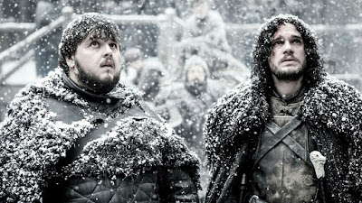

```text
Aku adalah burung gagak
Yang mencari kebebasan bahkan kekuasaan
Terbungkam di penjara bernama kehidupan

Aku adalah burung gagak
Terbang membawa pesan
Ke tempat yang ditujukan
Kembali pada rutinitas yang menjenuhkan
Selalu menjadi suruhan

Aku adalah burung gagak
Bukan karena kesetiaan
Melainkan tak punya pilihan
Demi cacing yang mempertahankan kehidupan

Aku adalah burung gagak
Bukan kakatua yang menawan
Atau elang yang rupawan
Yang dengan jati dirinya bisa melawan

Seumur hidup kuselalu bertahan
Namun yang kuingin hanyalah kebebasan
Dan sepertinya tuhan mengijinkan
Untukku keluar kandang

Temanku berkata patuhi atasan
Namun persetan
Aku punya kebebasan
Aku berhenti dari membawa pesan

Aku terbang penuh kesenangan
Aku punya kebebasan
Lalu aku terhenti kebingungan
Mencari arah jalan pulang

Namun Dengan kebebasan
Aku tak perlu arah pulang
Semuanya adalah tempat tinggal
Yang harus kucapai sekarang adalah kekuasaan

Sekali lagi aku terbang penuh kebebasan
Mencapai asap yang menggairahkan
Kucapai asap kekuasaan
Dan kuhirup harumnya ketamakan

Aku adalah burung gagak
Keteriakan dengan penuh kebanggaan
Dan aku kepusingan..
Kebingungan..
Keresahan..
Oleh asap kekuasaan
Dan aku dijatuhkan
Oleh aroma ketamakan

Dan disinilah aku
Tanpa kehormatan
Tak bisa memohon untuk mengulang

Penjara tak selalu berbentuk kandang
Ia bisa berbentuk kekuasaan
Yang tak bisa aku dapatkan
Hanya bermodalkan semangat kebebasan
```