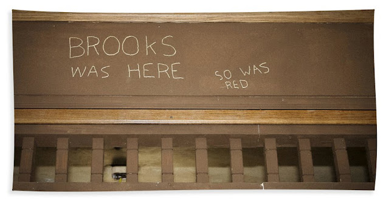

```text
Kadang nyoba ngerasain
Gimana jadi 'bapa' yang mencintai pekerjaannya disaat harus dipensiunkan oleh aturan mutlak. 
Ketakutannya dengan "apa yang selanjutnya bisa saya lakukan."

Lagi seneng2nya ke luar kota atau negeri untuk diskusi dan ngerjain proyeknya, 
banyak deadline dan jadwal yang harus ditunaikan. 
Bukan hanya sebatas mencari penghasilan, 
tapi sudah dianggap kebutuhan yang ga akan bisa tergantikan.
Alasan hidup.
Cinta pekerjaan.

Terus tiba2 pulang dari luar negeri. 
Liat jadwalnya dan ternyata tinggal beberapa bulan lagi ia dipensiunkan. 
Merenung di rumah, nonton tv, bahkan yang dulunya gasuka nonton bola, 
karena ga ada kegiatan lain akhirnya bola pun ditonton.

Gelisah mungkin? Hal biasa yang ditemukan oleh 
orang2 yang mencintai sesuatu, yang membutuhkan sesuatu.

Dan dipaksa berhenti melakukan sesuatu yang kita sukai itu, bebal memang!

Lagi main game enak2,terus dimarahin dan disuruh berenti karena kemaleman, menyebalkan!
Lagi asyik main di luar terus disuruh mandi karena udah kesorean, menyebalkan!
Lagi seneng bersahabat, pergi ke tempat tempat ga penting ngobrolin hal hal ga penting, buang waktu, 
terus disuruh introspeksi manfaat apa yang kamu dapat dari menghabiskan waktu, menyebalkan!
Lagi senang sendiri, baca buku, belajar, memperluas pengetahuan, 
terus dipaksa refreshing dan perluas pergaulan, menyebalkan!
Lagi deketin lawan jenis trs dipaksa berhenti karena dia sudah punya pacar, menyebalkan
Lagi seneng senengnya dapet nikmat keimanan, berusaha memperbaiki diri, melakukan hal bermanfaat, cinta dunia, 
terus dipaksa berhenti oleh kematian, itu...

~
Cinta sesuatu itu karena apa.
Sesuatu yang diberhentikan paksa itu atas dasar apa dan siapa yang bergerak di balik itu semua.

Sesatnya 'bapa' dikarenakan 'cinta'nya terhadap sesuatu selainnya. 'Bergantung' kepada sesuatu selainnya.

Kecintaan dan kebutuhan harus dibuang dan dipupuk sedalam-dalamnya. Mereka butuh objek dan alasan. Sedangkan mutlak kepatuhan hanya menghasilkan hukum

Karena tujuan hukum itu relatif atau bisa disebut tak hingga, maka ia boleh dikatan tak ada.

Terus kalo gamau gelisah karena cinta dan kebutuhan, kepatuhan terhadap hukum yang tak bertujuanlah alternatifnya

Ga ngerti? sama... aku juga bodoh, aku cuman bingung,
dia cinta sama siapa,
sama ciptaannya?
sama pekerjaannya?
dia patuh terhadap apa,
jika ia cinta dan berkebutuhan dan ketergantungan terhadap kita, anak-anaknya
bukankah bapa juga menuhankan dan menujuankan anak-anaknya?
Atau menujuankan tidak bisa dianggap sebagai hal yang vertikal atau linear
sehingga ia berbentuk siklus yang iterasinya tak hingga.
Kalo begitu bukankah hukum yang bertujuan tak memiliki tujuan?

Dan saat yang satu diberhentikan, siklus tersebut menjadi putus beserta elemennya
atau yang tidak diberhentikan atau memberhentikan menjadi satu
sehingga tak ada siklus
dan atau itu yang mungkin dinamakan
ketergantungan
kebutuhan
hukum
atau dengan kata lain
kesepian
```

