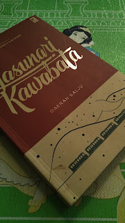

Roman fiksi pertama yang w baca dengan serius wkwkwk.

Awal baca ini taun kemarin sebenernya pas lagi gabut di rumah sodara nunggu ujian utul UGM. W beli dari toko di line paket 3 buku, yaitu ini, Meatspace, sama cerita detektif. Penasaran karena menang nobel kesusastraan jadi w baca ini dengan cepet pas di Jogja beberapa hari beres, terus...

"Hah? kok bisa menang ya? B aja perasaan, ya walaupun ada quotes ala-ala realist yang lumayan sih..."
dan w tutup itu buku dengan perasaan kecewa.......

Setaun berlalu, alhamdulillah udah diterima di UI. UAS udah beres, lagi masa pandemi, internet smartfren lelet banget, film ga ada yang seru, liat rak buku, penasaran, ingin baca lagi.

Dan akhirnya w baca dengan selow dari kata pengantar, berusaha mahamin semua kata-katanya....
Pengarangnya bunuh diri, novel ini katanya susah banget buat diterjemahin, alirannya beda sama novel2 pada umumnya, dan setelah w baca ulang, Walaupun ga relate dan banyak istilah aneh2 ditambah terjemahannya menurut w kurang pas ada banyak hal yang ternyata bisa dipelajarin dari novel yang cukup singkat ini yang endingnya gatau kemana, juga ada banyak hal "bagus" yang bisa dibayangin dari baca ini.

-----

Jadi ceritanya tentang laki-laki pelancong/turis, namanya Shimamura, yang ingin neliti tentang berbagai macam tarian di dunia. Dia udah nikah dan hidup dari warisan keluarganya juga, semacam orang kaya. Nah terus pas perjalannya buat neliti ini si Shimamura semacam ngeliat cewek cantik yang ngerawat laki-laki sakit, eh ternyata 2 orang ini berhubungan sama tempat dia nyewa buat penginapan. Di penginapan, dia ketemu geisha yang ternyata dia juga punya hubungan sama 2 orang di kereta tadi. Dari plot itulah digambarin hubungan kompleks yang nyeritain kehidupan.

-----

Intinya menurut w sih novel ini tentang hidup. Gatau kenapa w suka banget sama cerita-cerita tentang kepasrahan hidup. Dari sini w ngeliat bahwa manusia dimanapun sama aja, rasa penasaran, nafsu, cemburu, rasa bersalah, pengasihanan, malah jadi cinta, malah jadi gila.

Awalnya si Shimamura ini penasaran sama hubungan Yoko, cewe cantik di kereta yang diliatnya, ngerawat laki2 sakit2an kayak ngerawat suaminya sendiri

Dan ternyata dia tau laki2 yang sakit di kereta itu katanya tunangannya si Komako(cewek yang bakal w jelasin di bawah).

Setelahnya dia berhubungan sama si Komako di penginapan dan nyari tau sebenernya apa permasalahannya, rasa kasihan dan kepolosan Shimamura, di satu sisi mungkin dia ngerasa bersalah ke istri dan keluarganya yang mungkin gatau tentang hubungannya sama si Komako ini. Tapi di sisi lain dia ngerasa "kasian" sama Komako, geisha patah hati yang ngejalanin hidup sebisanya.

Shimamura yang dilambangkan sebagai orang dengan priviledge yang polos yang dengan mudahnya ngelakuin sesuatu dalam hidupnya. Dan walaupun dapet priviledge bukan berarti Ia bisa berlaku sesukanya, w rasa dia punya sedikit rasa tanggung jawab moral ke keluarganya tapi di sisi lain dia kasian sama si Komako yang berjuang hidup tapi gatau untuk apa

Berangkat dari penasaran, mulai terlibat, mulai tau, mulai kasian, mulai ngerasa bersalah, mulai gila, makin cinta, makin jadi tuhan

Terus cerita Komako, cewe polos yang awalnya cuman belajar tarian-tarian. Terus berkembang jadi geisha yang awalnya malu-malu.

Sebenernya w juga masih gatau geisha tu apa, minimalnya ya wanita penghibur kayak biasa dan ga aneh-anehlah. Tapi yang paling liar mungkin menjerumus ke arah "sana"? Yang dianggap masyarakat jauh dari nilai moral.

Kisah cinta rumitnya sama laki2 di kereta yang dirawat Yoko, hubungan anehnya juga sama Shimamura. Dan yang paling ngeheranin ternyata di sisi lain dari seorang geisha, dia suka nulis semacam diari yang sudah berhalaman-halaman sehingga Shimamura menggumam,

"Keindahan yang sia-sia"

Rasa pasrahnya ternyata ga cuman pasrah, tetep dia ini mungkin ngarepin sesuatu yang namanya "Cinta" dan berusaha "love what you do"

Doi seenggaknya melakukan usaha indah untuk mencapai sesuatu, meski ga tau hasilnya apa
Kepasrahan optimis tanpa dasar yang mungkin ga semua orang bisa ngelakuin.

Dan walaupun mungkin kelakuannya salah, yaitu berharap sama orang yang udah "dipunyai",
tapi di sisi lain w kasihan karena dari ceritanya emang bener-bener menyedihkan.

Terus dari situ bisa diambil sudut pandang, ntah kesalahan apapun yang dilakukan orang, selama masa lalunya kelam, hal itu bisa dijadiin tameng buat semua hal yang dilakuinnya
Semacam tebusan kenikmatan atas tragedi yang sudah dirasakan.

Sehingga apapun pekerjaan manusia, ga ada bedanya secara arti finansial. Karena semuanya buat "uang" "pahala" suatu fantasi yang dengannya manusia bisa ngedapetin semua hal. Semuanya cuman bisnis, ntah jual badan, jual agama, nipu, dll. Dan semuanya sama-sama berusaha manipulasi
yang lain untuk ngedapetin apa yang diinginkannya. Dan ini bukanlah suatu sudut pandang negatif tapi lebih kepada suatu fitrah atau kewajaran atau sesuatu yang ada dalam insting awal manusia.

Mencintai dengan murni, katanya, cuman perempuan yang bisa melakukannya. Tentang penulisnya, gatau kenapa, walaupun w ga pernah ngerti dan ngerasain tentang wanita, tapi ya kayak cocok dan pas aja sih. Ya tapi gatau juga kalo dari sisi perempuan sendiri apa emang sesuai dengan yang dirasain dan bisa kayak si Komako.

Berusaha ngelakuin yang bisa dilakuinnya, sepenuh hatinya
usaha indah yang sia-sia, kesimpelan yang dibuat rumitnya,
pikiran anehnya, sudut pandang anehnya, semuanya aneh dalam novel ini

Ya tapi seenggaknya dari novel ini w belajar,

Meski keadaan ga seperti yang diharapkan,

Meski "diperkosa" takdir dan harapan,

Meski gatau ntah apa yang dilakukan,

Meski gatau kemana harus melangkah,

Seenggaknya w harus tetap berusaha

Usaha sia-sia yang indah

Untuk menemukan "sesuatu" itu

"Mengejek diri sendiri dengan pekerjaan sendiri barangkali merupakan kesenangan yang manja. Mungkin dari sanalah lahir dunia hayalnya yang patut dikasihani"