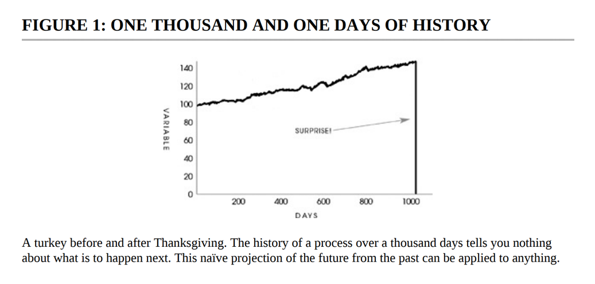

If someone automates Instagram to like every account they follow, reply, and comment based on the context of the picture you post, you will find some sort of excitement if that someone is who you like, and otherwise if you don't like. Humans can be easily fooled because of the feature of 'feeling.'

Humans are not multitaskers, but with computers, they can be. Computers resemble the Jutsu of a thousand shadows from Naruto. And if you interact with their shadow, would you find it unethical or consider it disrespectful, or not prioritizing yourself?

This is something I learned from Yudkowsky.

The dilemma between thinking for the future, going one step beyond everyone, and ending up overanalyzing and making assumptions, or simply enjoying the present 'carpe diem' moment, where you might end up like any turkey problems.

To be truly balanced does not exist. We often create an illusion of balance while making choices about our careers, the friends we choose, and the family we keep, even though there are always better and worse options.

Someone who strives for balance may end up with nothing, which is why one must pick a side and defend it, no matter what happens, to avoid cognitive dissonance.

Whether you're an AI doomer trying to regulate and track everything or just trying to accelerate an experiment and perhaps meet an untimely end, I prefer the latter.

One should limit their viewpoint because curiosity is nothing but a castration pill. Someone who tries a little bit to understand multiple sides may become overwhelmed, as they have seen both hell and heaven as perceived by others.

Statisticians, data analysts, and knowledge seekers are like eunuchs who have castrated themselves. They consider all women to be equally good, yet the woman within them is never understood. They often justify their cowardice with a thousand excuses, and the only courage they possess is to kill the woman within themselves.

Would you die for Islam, my brother?