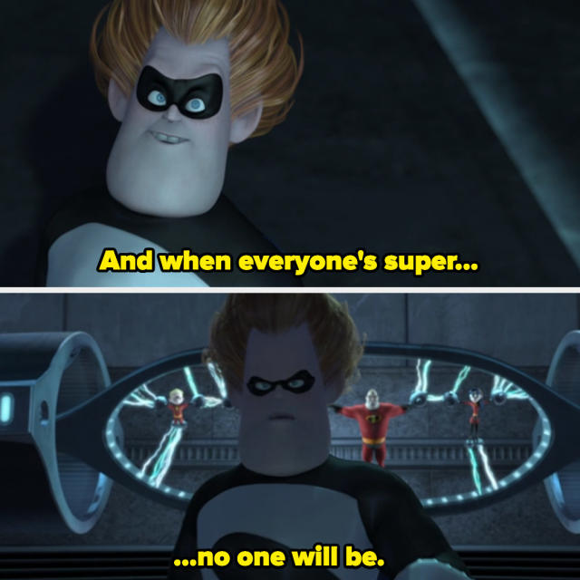
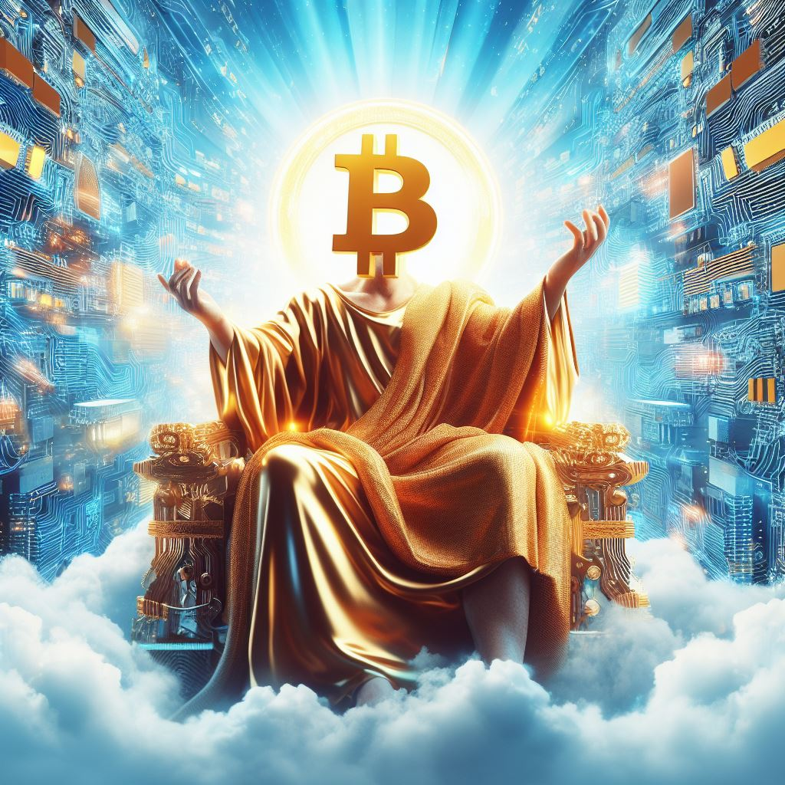
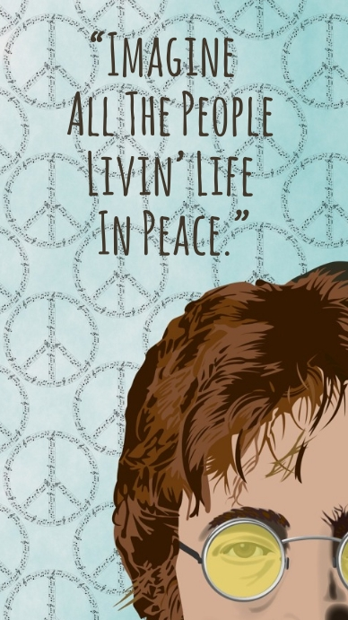
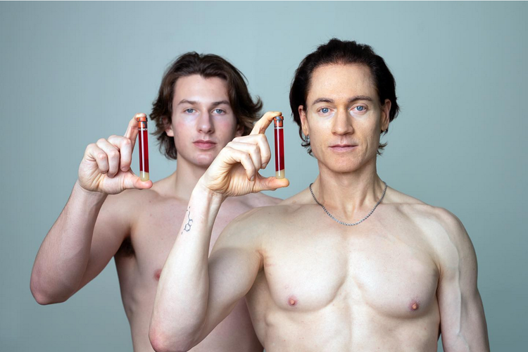
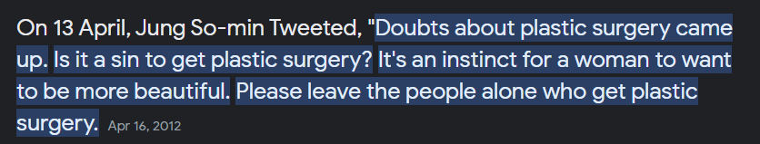
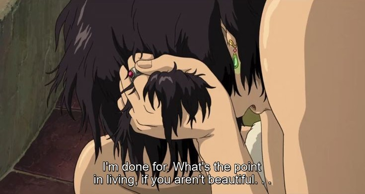
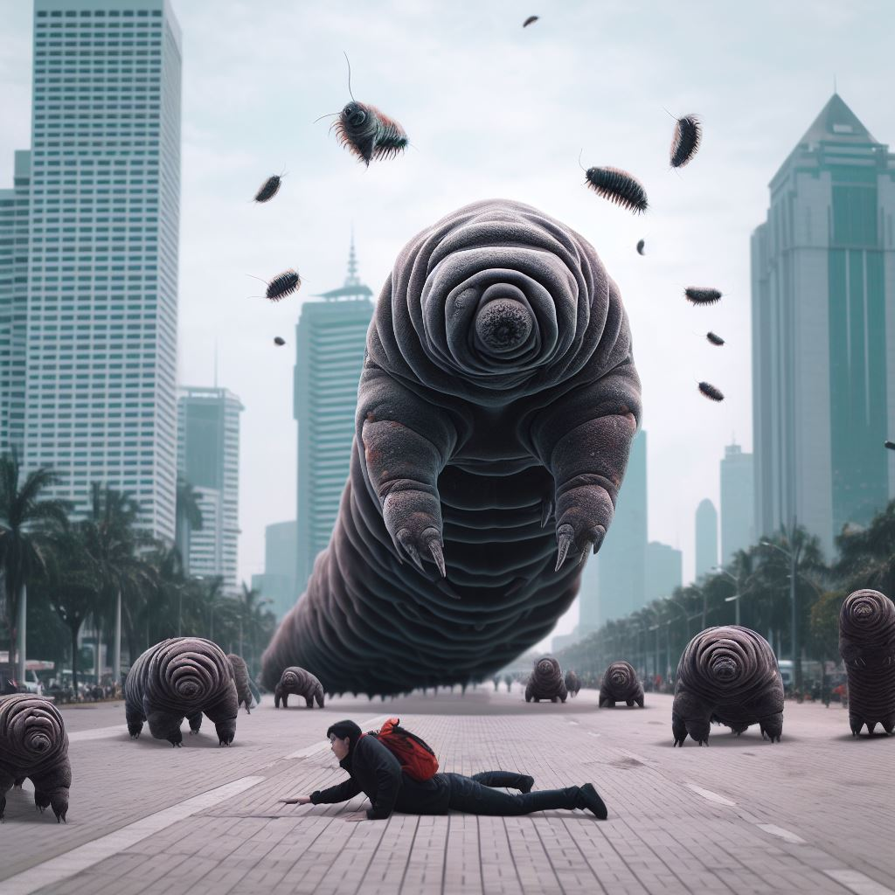



When you throw away the concept and the dimension of time, you'll find that the effort put into grooming yourself is a futile endeavor, contributing to the perpetuation of the "halo effect" ideology.

We cannot be blind to the innovations in chemistry, pharmaceuticals, marketing, etc., that contribute to shaping our world in this way. Transforming someone from unattractive to beautiful is a form of empowerment.

Much of the progress and growth appears empowering, until it becomes mainstream. And when you lose track of time, you know it's bound to happen. You observe that things that become mainstream tend to lose their value easily.

If you think far into the future, what mediums and aspects will represent and symbolize beauty? By now, where physical beauty is easily attainable, I suspect physical attractiveness will lose its status as a symbol of beauty, because everyone can achieve it effortlessly.

It's akin to the concept of Bitcoin. Ugliness becomes scarce, and due to scarcity bias, the unattractive become valuable.

And this is the message they truly want to convey. The process of empowerment is futile, because fundamentally, many people are drawn to the gaps between ugliness and beauty. It's these gaps that romanticize the story.

Someone who aims to empower everyone means they want to close these gaps. Others, however, will vilify those who seek to empower everyone, considering them as the villains. The effort to bridge these gaps involves either making everyone beautiful or embracing the opposite.

From this perspective, this individual is actually a villain because what he preaches is making everyone beautiful to close the gaps. The specific process intended to achieve 'universal beauty' doesn't matter.

Someone like him fights entropy in an attempt to attain eternal beauty. Those who follow him probably find ecstasy in imagining the dragon being slain in "The Fable of the Dragon-Tyrant"



They ask, what's wrong with pursuing the eternal? What's wrong with not dying? What's wrong with being beautiful all the time? Why is it considered to be exceeding limits?

"O company of jinn and mankind, if you are able to pass beyond the regions of the heavens and the earth, then pass. You will not pass except by authority." (Ar-Rahman: 33)

And he always convinces himself, everyone can be beautiful. One can strive to reach for the heavens; it is not passing the limits. Empowering everyone is not exceeding limits.

Applying micellar water, face wash, toner, serum, moisturizer, sunscreen +-1 hour a day. Makeup, lip balm, perfume, hairstyling, fashion, hitting the gym, plastic surgery, 

seeking refuge in a metaverse online avatar that exudes grace and elegance, manipulating images and videos to align with what is perceived as the taste of many people, 

carefully choosing what is 'good' and discarding what is 'bad' about what one wishes to display in their resume, both in the virtual and real worlds. Monday to Friday deceiving people, Saturday and Sunday deceiving God.



"Indeed, Allah is beautiful and He loves beauty." (Narrated by Muslim from Ibn Mas'ud, may Allah be pleased with him).

Body, soul, and spirit should embody beauty. It truly isn't exceeding limits to pursue beauty.

TL;DR: I don't engage in the time-consuming rituals mentioned above because in the future beauty standards will be determined by individuals like these.

