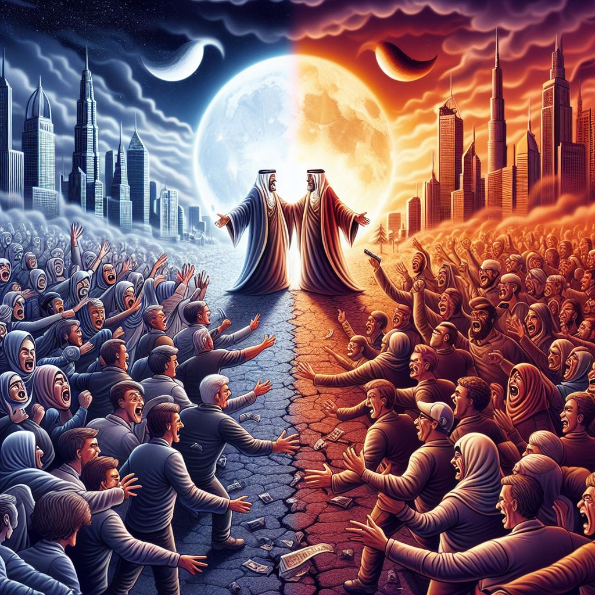
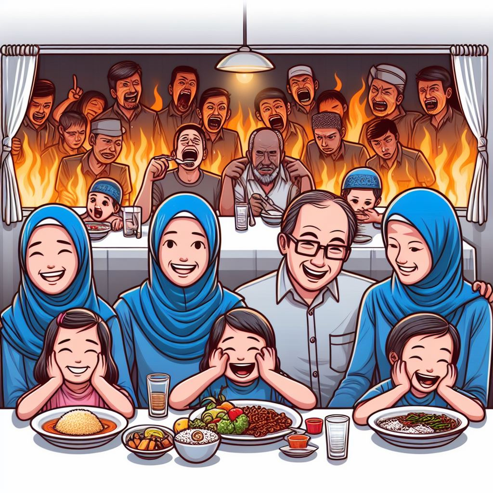
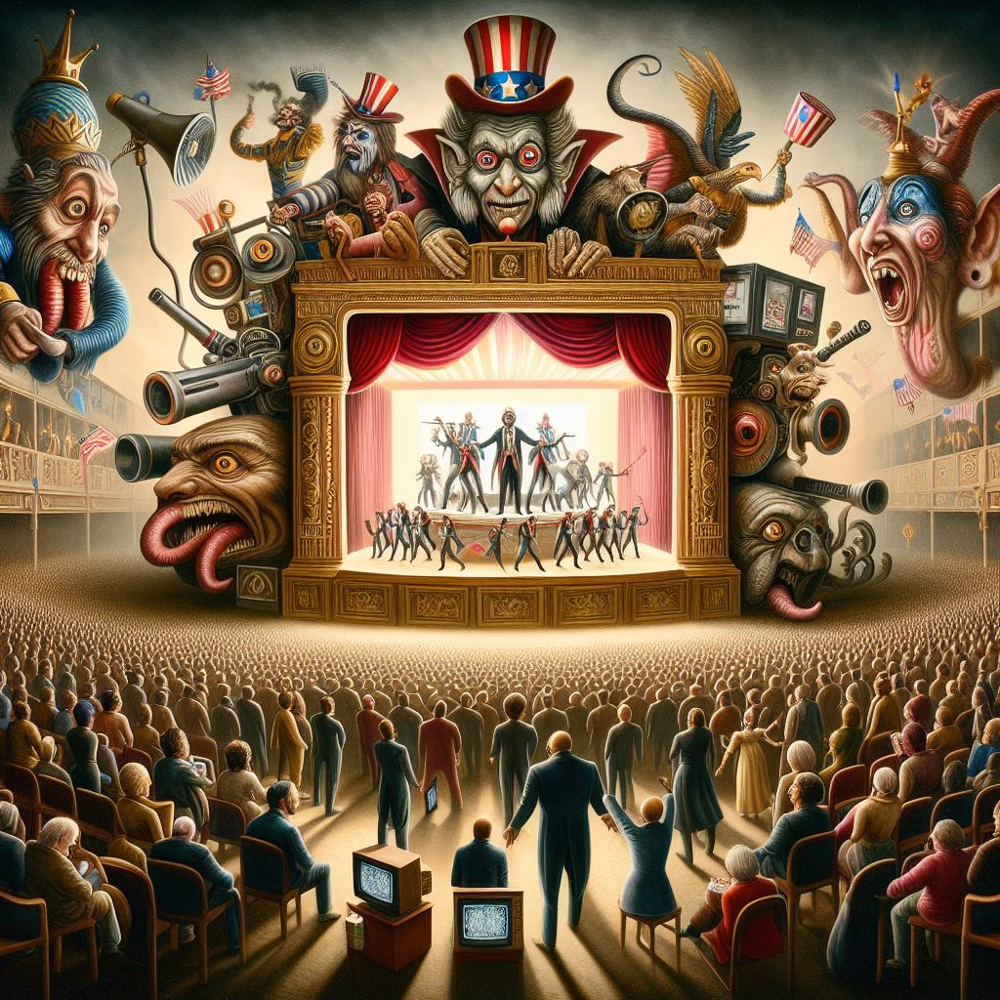



Orang utilitarian gini mirip komunis lemah syahwat, selalu cari silver bullet untuk melengkapi lobang ideologinya. Kalo ga sesuai tinggal potong2 minoritas dan buang outlier selayak procustes tentang apa2 yang ga sesuai sama mereka karena kurang bisa menerima diversitas dan buru-buru ingin perfect. That's why I love them. 

Dengan prinsip macam itu, saat mereka ditanya, "What makes you happy?" Jawaban paling berakhlak dan ethical yang paling dapat diterima harusnya gini:

---

watching sinnu and shai leaders and their followers gather to debate over trivial matters in a specific time and place, insulting each other, and concluding that they are not meant to be together. instead of behaving politically correct or engaging in endless debates, they simply nurture hatred and occasionally mock each other because they believe that hatred is 'fitrah', and they are grateful with being hateful individuals. they only compete to make aslim to be rahmatan lil alamin.

they compete by hastening social, economic, cultural, and spiritual KPIs through experiments involving neuro-GMOs and quantum computing projects conducted by some mad scientists. they also focus on building happy families through effective indoctrination, asserting that children don't deserve happiness until palestine is free. 

their focus is not on leisure activities like pursuing useless college degrees, various mundane dining experiences, pointless sports, insipid drama movies, melancholic songs, or idolizing those who behave sweetly. they disregard ultra AAA games with soulless storylines, manipulative vacations, and teaser-filled travels.

their emphasis lies in contributing, particularly in creating sophisticated military equipment and data-driven weapons to combat all tyrants masquerading as part of the entertainment industry. 

however, they aim to maximize entertainment to remain grateful every day only for the means to liberate all oppressed people. they strive to achieve agi and singularity to bring humans closer to their creator.

they suggest letting jesw, chenesi, and isethat become global leaders because some of them are more competent to serve as a 'khalifah' and potentially make the world a better place as rahmatan lil alamin better than most mislums.

